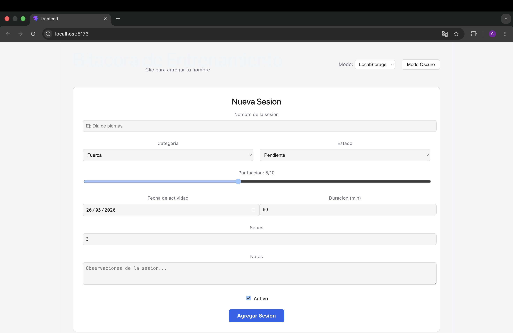
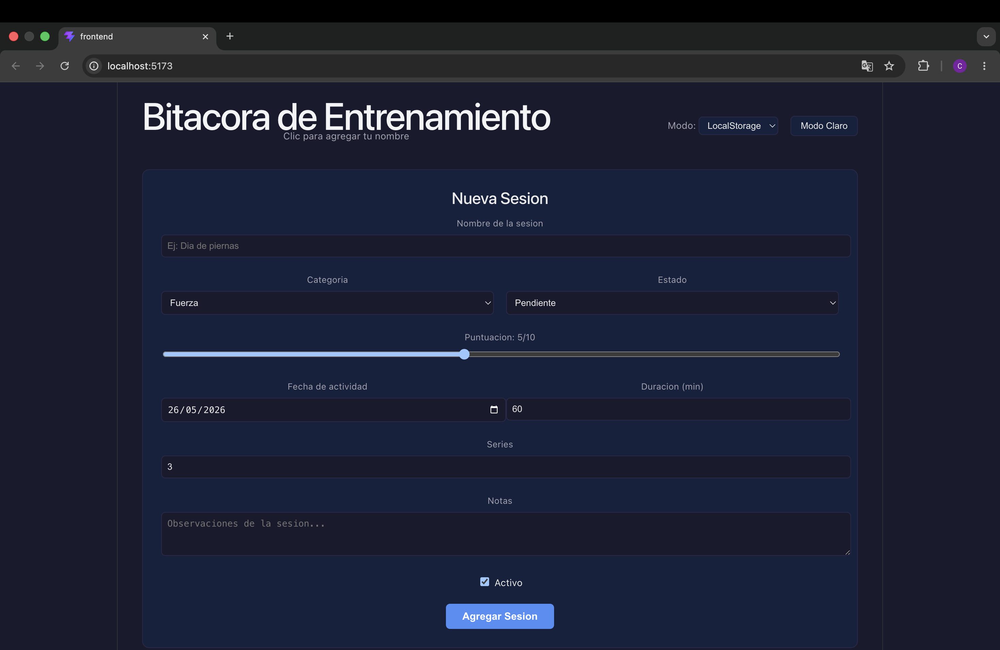

# Mi Colección Personal — Bitácora de Entrenamiento

App full-stack para registrar y gestionar sesiones de entrenamiento físico personal.

## Stack Tecnológico
- **Frontend:** React 18 + Vite, useState, useEffect, useContext, useRef
- **Backend:** Node.js + Express + SQLite (better-sqlite3)
- **Persistencia:** LocalStorage (modo local) o API REST (modo API)

## Estructura del Proyecto
mi-coleccion-personal/
├── frontend/
│   └── src/
│       ├── components/
│       │   ├── FormularioItem.jsx
│       │   ├── ListaItems.jsx
│       │   └── ItemCard.jsx
│       ├── context/
│       │   ├── StorageContext.jsx
│       │   ├── ThemeContext.jsx
│       │   └── UserContext.jsx
│       ├── utils/
│       │   ├── storage.js
│       │   └── categorias.js
│       └── App.jsx
├── backend/
│   └── src/
│       ├── routes/items.js
│       ├── db/database.js
│       └── index.js
├── .gitignore
└── README.md

## Modelo de Datos — Sesión de Entrenamiento

| Campo | Tipo | Descripción |
|---|---|---|
| id | UUID | Identificador único |
| nombre | string | Nombre de la sesión |
| categoriaId | string | fuerza, cardio, hiit, flexibilidad, descanso |
| estado | string | pendiente, completado, cancelado |
| puntuacion | number | 1-10 |
| fechaRegistro | string ISO | Fecha de creación |
| fechaActividad | string ISO | Fecha de la sesión |
| notas | string | Observaciones |
| atributos | JSON | { duracion, series } |
| activo | boolean | Si está activo |

## Categorías

| ID | Nombre | Color |
|---|---|---|
| fuerza | Fuerza | #e74c3c |
| cardio | Cardio | #3498db |
| hiit | HIIT | #f39c12 |
| flexibilidad | Flexibilidad | #2ecc71 |
| descanso | Descanso | #9b59b6 |

## Cómo Correr el Proyecto

### Frontend
```bash
cd frontend
npm install
npm run dev
# Abre http://localhost:5173
```

### Backend
```bash
cd backend
npm install
node src/index.js
# Corre en http://localhost:3000
```

## Endpoints API

| Método | Endpoint | Descripción |
|---|---|---|
| GET | /api/items | Lista todas las sesiones |
| GET | /api/items/:id | Obtiene una sesión |
| POST | /api/items | Crea una sesión |
| PUT | /api/items/:id | Actualiza una sesión |
| DELETE | /api/items/:id | Elimina una sesión |
| POST | /api/items/:id/registro | Agrega un registro |

## Capturas

### Modo Claro


### Modo Oscuro


## Fases Completadas

### Fase 1 
- useState con lazy initializer
- useEffect para sincronizar con LocalStorage
- CRUD completo en frontend
- API REST con Express + SQLite
- CORS configurado

### Fase 2 
- StorageContext — abstrae API vs LocalStorage
- ThemeContext — claro/oscuro con variables CSS y atajo T
- UserContext — nombre y preferencias persistidas
- useRef #1 — focus en input tras agregar sesión
- useRef #2 — setInterval para auto-refresh en modo API
- 5 categorías con color hex en utils/categorias.js