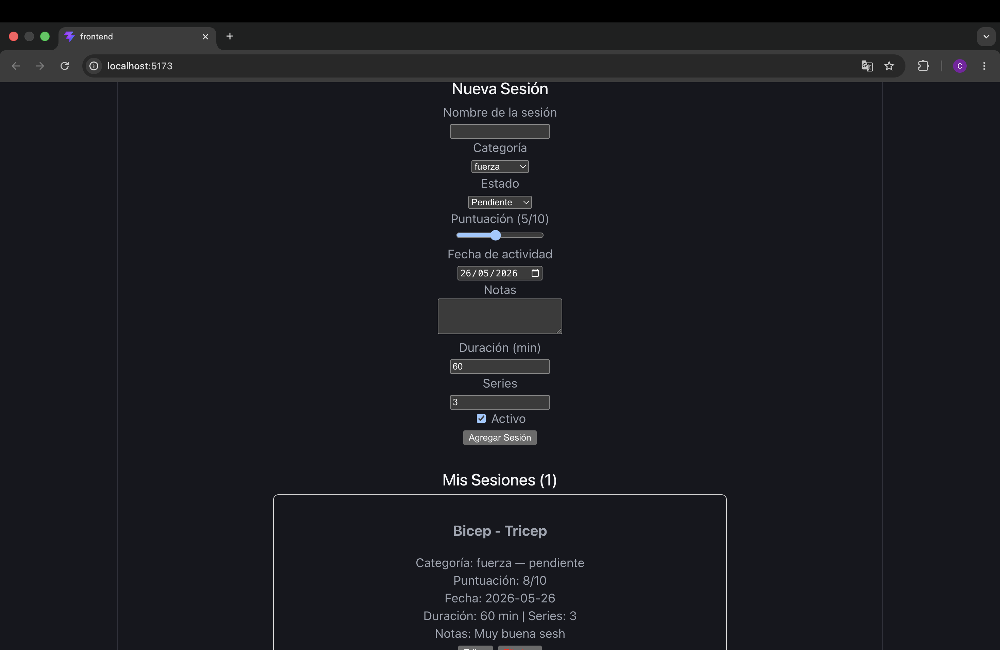

# Mi Colección Personal — Bitácora de Entrenamiento 

App full-stack para registrar y gestionar sesiones de entrenamiento físico personal.

## Stack Tecnológico
- **Frontend:** React 18 + Vite, useState, useEffect, LocalStorage
- **Backend:** Node.js + Express + SQLite (better-sqlite3)
- **Estilos:** CSS inline (Fase 1)

## Estructura del Proyecto
mi-coleccion-personal/
├── frontend/         # React 18 + Vite
│   └── src/
│       ├── components/
│       │   ├── FormularioItem.jsx
│       │   ├── ListaItems.jsx
│       │   └── ItemCard.jsx
│       ├── utils/
│       │   └── storage.js
│       └── App.jsx
├── backend/          # Express + SQLite
│   └── src/
│       ├── routes/
│       │   └── items.js
│       ├── db/
│       │   └── database.js
│       └── index.js
├── .gitignore
└── README.md

## Modelo de Datos — Sesión de Entrenamiento

| Campo | Tipo | Descripción |
|---|---|---|
| id | UUID | Identificador único |
| nombre | string | Nombre de la sesión |
| categoriaId | string | fuerza, cardio, hiit, flexibilidad, descanso |
| estado | string | pendiente, completado, cancelado |
| puntuacion | number | 1-10 |
| fechaRegistro | string ISO | Fecha de creación |
| fechaActividad | string ISO | Fecha de la sesión |
| notas | string | Observaciones |
| atributos | JSON | { duracion, series } |
| activo | boolean | Si está activo |

## Cómo Correr el Proyecto

### Frontend
```bash
cd frontend
npm install
npm run dev
# Abre http://localhost:5173
```

### Backend
```bash
cd backend
npm install
node src/index.js
# Corre en http://localhost:3000
```

## Endpoints API

| Método | Endpoint | Descripción |
|---|---|---|
| GET | /api/items | Lista todas las sesiones |
| GET | /api/items/:id | Obtiene una sesión |
| POST | /api/items | Crea una sesión |
| PUT | /api/items/:id | Actualiza una sesión |
| DELETE | /api/items/:id | Elimina una sesión |
| POST | /api/items/:id/registro | Agrega un registro |

## Mis Sesiones Registradas



## Fase 1 — Completada 
- [x] useState con lazy initializer
- [x] useEffect para sincronizar con LocalStorage
- [x] CRUD completo en frontend
- [x] API REST con Express
- [x] Base de datos SQLite
- [x] CORS configurado